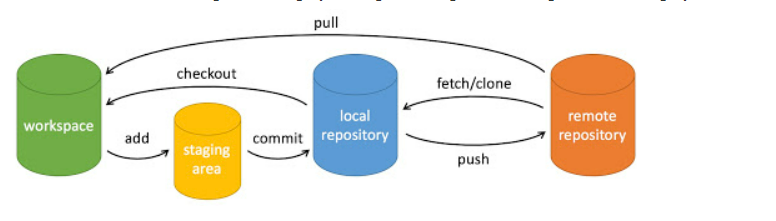
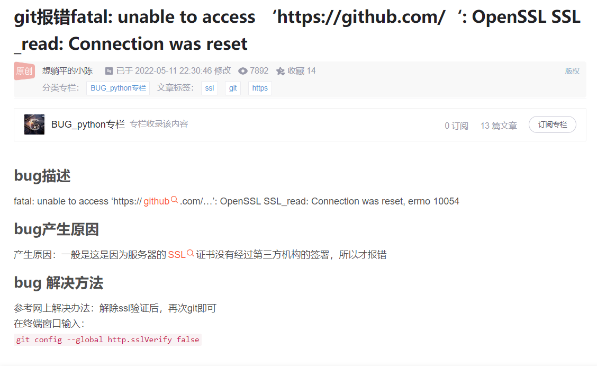
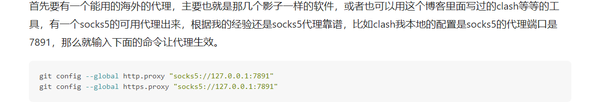

# Git_study


## Git的结构



相当于有4个东西

1. workspace: 就是我本地电脑的文件
2. 暂存区
3. 本地仓库
4. 远程仓库:GitHub上面的东西

比较重要的就是1和4,中间两个没什么关系

## 怎么用

git add .将所有文件提交到暂存区

git commit -m "说明" 将在暂存区的东西拿去本地仓库里

git push 将本地仓库里的东西提交到远程仓库

-----

git pull 把GitHub上的东西拉去到本地


## 常见GIT命令

```bash
git init 初始化一个仓库,会生成.git文件
git status 查看文件状态
git add . 添加到暂存区
git commit -m "说明" 把暂存区里面的文件放到本地仓库

git push 将本地仓库的东西推送到远程仓库
git pull 将远程仓库里的东西拉去到本地工作区

.gitignore 文件,在里面存放不需要跟踪的文件名称


```

涉及分支的命令

```bash
git branch branchname  新建分支
git checkout branchname 切换分支
git merge 合并分支
git branch -d branchname 删除分支
git branch 查看有什么分支现在
```


## 参考资料

https://www.runoob.com/git/git-basic-operations.html
https://backlog.com/git-tutorial/cn/stepup/stepup3_1.html
https://www.bilibili.com/video/BV1FE411P7B3?p=12&vd_source=a46dd0375a979b926c659d335bb1f210
https://www.bilibili.com/video/BV1r3411F7kn/?spm_id_from=333.788.recommend_more_video.-1&vd_source=a46dd0375a979b926c659d335bb1f210

## 遇到的问题

访问速度不行,无法 git clone 或者无法git push



命令是

```
$ git config --global http.sslVerify "false"
```

这种搞了之后关了代理可以正常用了,但是开着代理用不了


所有还要修改git走代理




````
git config --global http.proxy "socks5://127.0.0.1:7890"
git config --global https.proxy "socks5://127.0.0.1:7890"
````

